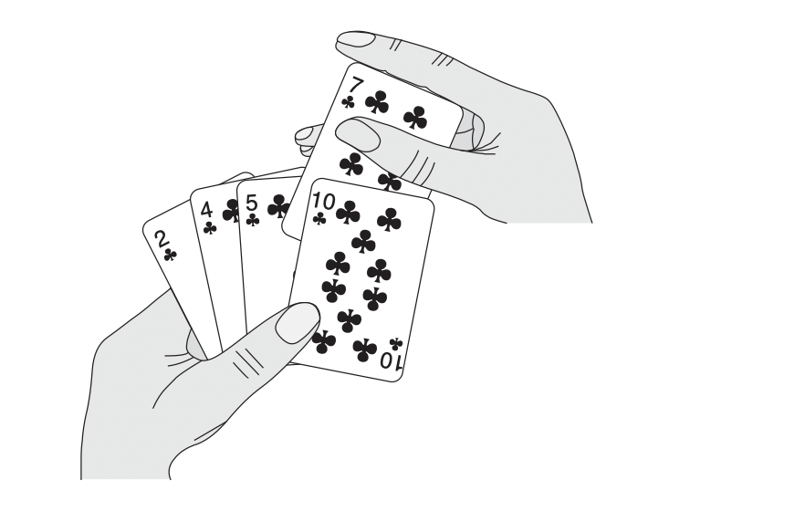

## Insertion Sort

* Insertion sort is an inplace sorting algorithm.
* It takes the array A and the length of the array, rearranges the numbers within the array A, and return the sorted array A when the sorting procedure is finished. 
* Insertion sort is an efficient and simple sorting algorithm. 
* Insertion loss can works on both numbers and strings given that we compare(<) a given key with other keys at time. 
* Insertion loss works exactly like how human would sort playing cards: start with empty lefthand and cards on table>>remove one card at time from the table and insert it into the correct position in the left hand>>to get the correct position of the card, we compare it with each of the cards already in hand, from right to left. Finally, the cards in the left hand will be sorted. 



Image credit: Introduction to Algorithms

Below is the pseudocode of insertion loss

```python
def insertion_loss(A):
    for j = 2 to A.length
    key = A[j]
    # Insert A[j] into the sorted sequence A[1..j-1]
    i = j-1
    while i>0 and A[i] > key:
        A[i+1] = A[i]
        i = i-1
    A[i+1] = key
```
