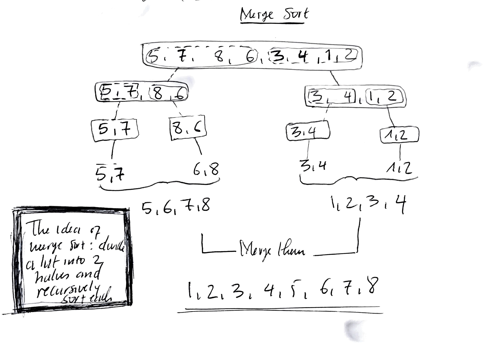

### Merge Sort

* Merge sort is also a `divide and conquer` algorithm that divide the array into two subarrays and then recursively sort each subarray and combine the results at the end to sort the array. 
* Intuitively, merge sort works in the following 3 steps:
  * *Divide*: Divide the array of a given n elements into two subarrays of size n/2. 
  * *Conquer*: Sort the subarrays recursively using the merge sort. 
  * *Combine*: Merge the two sorted subarrays into a single sorted array to get the final results. 

* If the array to be sorted has 1 element, nothing needs to be done. 
* The runtime of the merge sort is O(NlogN) since resursive call takes O(NlogN) time. 
* The runtime of a recursive function is the sum of the runtime of its subfunctions.
* The effiency of merge sort depends on how the sorted subarrays are combined.

Here is the pseudocode for merge sort:
```
def merge_sort(A, low, high):
    """
    Sort the array A using merge sort algorithm. 
    low and high are the indices of the subarray of A to be sorted. 
    """
    if low < high:
        mid = (low + high) // 2
        merge_sort(A, low, mid)
        merge_sort(A, mid+1, high)
        merge(A, low, mid, high) # merge() is a function to combine the sorted arrays. 
```

Here is the visual representation of merge sort:



