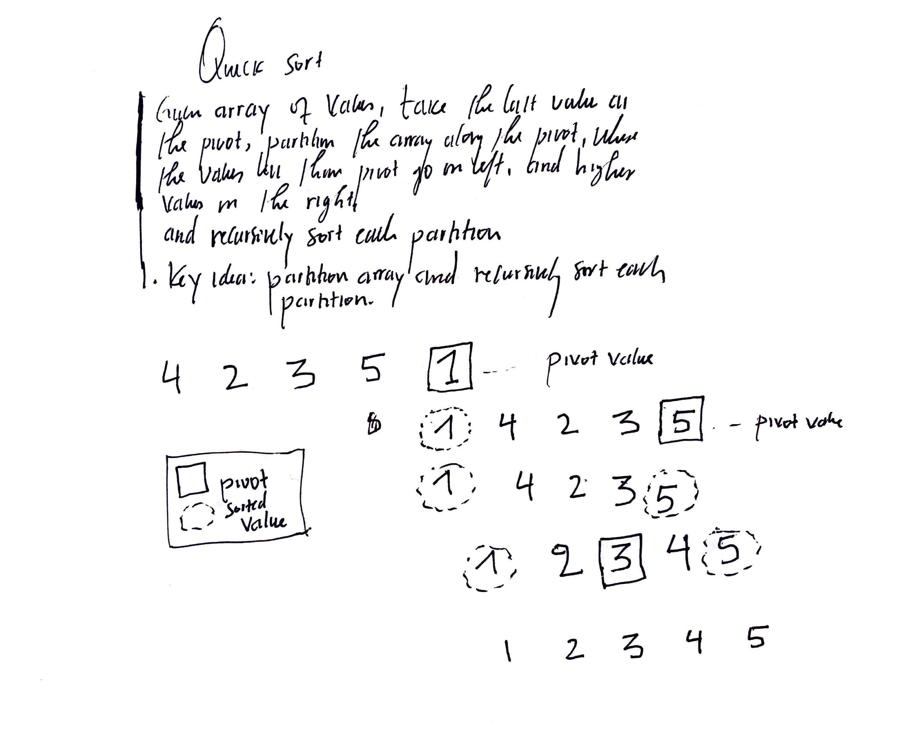

## Quick Sort

* Quick sort is a `divide and conquer` algorithm that uses a recursive approach to sort an array or a list of values. 
* The main idea is to partition the array or list into two parts, the left side which is less than the pivot value, and the right side which is greater than the pivot value. 
* If the array contains the repeated values, then we can have multiple similar similar values. If the values in array are distinct or unique, then pivot value is only just a single value. 
* In most cases, the pivot value is the last element in the array. But there is a randomized version of quick sort called `randomized quick sort` that uses a random element as the pivot value.


Here is an example of sorting an array of numbers with a quick sort algorithm:


*Image by Jean*

Below is the pseudocode for quick sort:

```
def quick_sort(A, low, high):
    """
    Sort the array A using quick sort algorithm. 
    low and high are the indices of the subarray of A to be sorted. 
    """

    if low < high:
        p = partition(A, low, high)
        quick_sort(A, low, p -1)
        quick_sort(A, p+1, high)

```

* The runtime of quick sort is O(N^2) in the worst case scenario. Quick sort has high runtime complexity because it is a recursive algorithm. 
* The randomized quick sort (with random pivot) has a runtime complexity of O(NlogN), where N is the number of elements in the array.
* Is quick sort really quick? Well, maybe not. But it is a good choice for sorting small arrays, and it can perform much faster than merge or heap sort.
* The next is the real [implementation](algorithms/quick-sort.py) of a quick sort. 