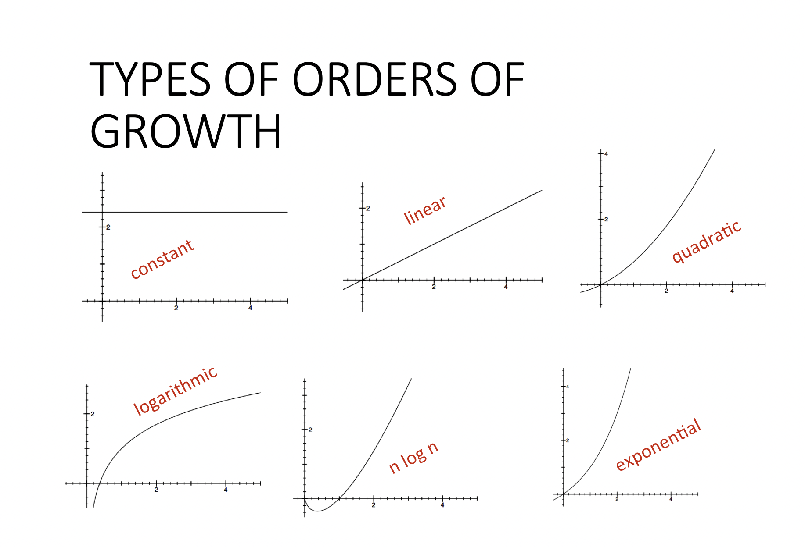
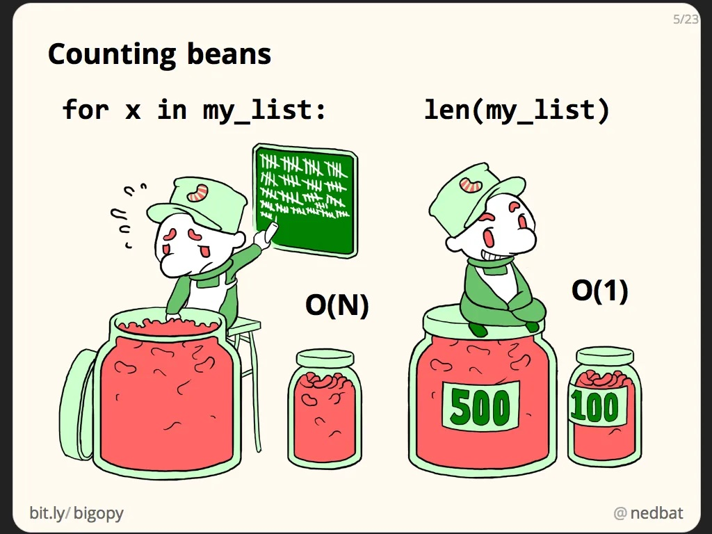
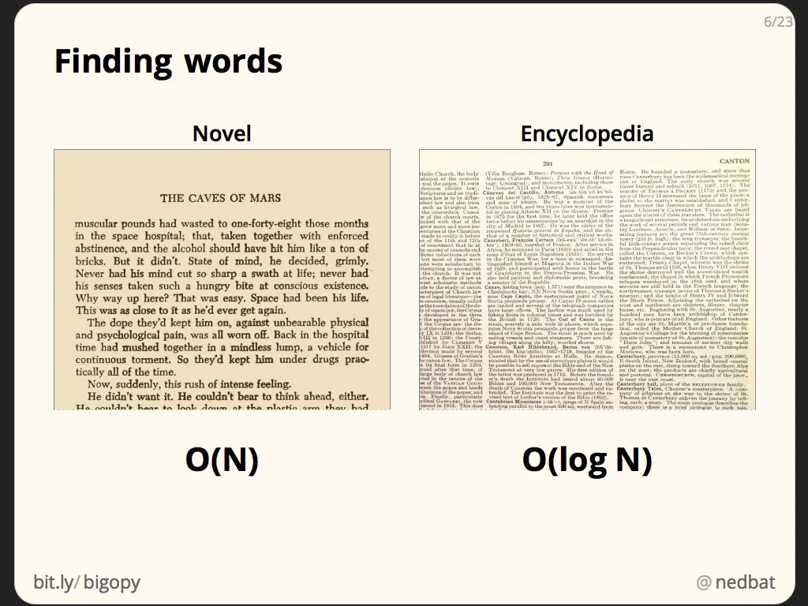
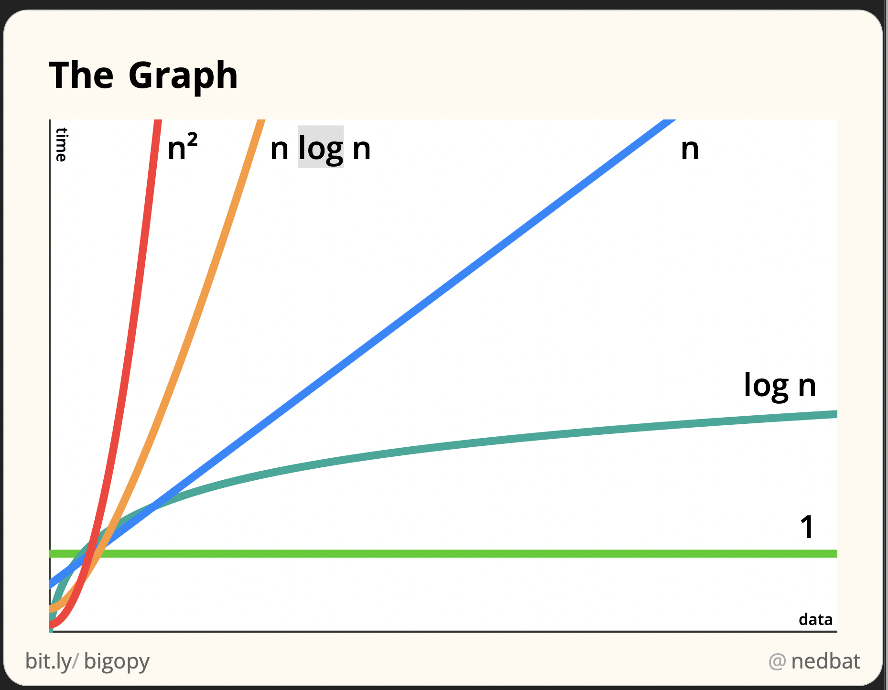

# Measuring Algorithm Efficiency with Big-O
<a name='0'></a>
*******

*Content:*
* [Introduction](#1)
* [Measuring Program Efficiency with Timer and Counting Operations](#2)
* [The order of Growths](#3)
* [Python Time Complexity](#4)
* [Summary and Tricks](#5)
* [References and Further Learning](#6)

*******
<a name='1'></a>
### Introduction

* Big Oh or Big-O time is a metric used to measure the efficiency of the algorithms. 
* Big-O is also referred to as `algorithmic complexity`, `time complexity`, `space complexity`, and `asymptotic complexity`.
* As Ned Batchelder said, Big-O is measuring *"`how code slows as data grows.` Big-O isn’t about how fast your code goes at any particular time. It’s about how the running time changes as the data size changes."*
* We will use Ned talk about Big-O in some part of this tutorial. You can watch the whole talk [here](https://www.youtube.com/watch?v=duvZ-2UK0fc).

* To develop faster algorithms, it is important to understand Big O. 
* Big O is a notation that describes the order of growth of an algorithm. The lower the order of growth, the better.
* Measuring program efficiency is one of the hardest challenges in solving computational problems. Programs can be implemented in different ways, with different algorithm, and can run on different machines. How one can measure the time efficieny of the algorithm regardless of the approach, type algorithm and machine running the algorithm?
* In addition to Big O, there are other two techniques for measuring the efficiency of the programs which are `timer` and `counting the operations`. Before we talk about Big O, let's see the downsides of those two techniques. 

<a name='2'></a>
## Measuring Program Efficiency with Timer and Counting Operations

### Using Timer

* Measuring the program efficiency using `timer` means timing the program from the beggining of execution to the end of program execution.
* Python has two modules `time` and `timeit` that can be used to measure the runtime: the amount of time it takes to run a program. 
* As you can imagine, the fastest programs has low runtime. The higher the runtime, the slower the program.
* With `time` module, you start the time, run the program, and stop the clock. 
* See the code below:

******************
  
```python
import time

def add_numbers(L):
    """
    Add all numbers in a list
    and return sum
    """

    num_sum = 0
    for i in L:
        num_sum += i
    return num_sum

# Timing the program

t0 = time.time_ns()
num_sum = add_numbers([1,2,3,4,5,6,7,8,9,10])
t1 = time.time_ns() - t0
print(f"Solution: {num_sum}, function runtime in nanoseconds: {t1}ns")
# Output: num_sum = 55, function runtime in nanoseconds: 34000ns
# Time changes at every run!!
```
******************

* Measuring the program efficiency with timer can not really tell us much about the efficiency of the program. Time varies for different inputs but it can not express the relationship between the inputs and time it takes to run the program.
  
* Also, timing evaluates the implementation and the capacity of the machine running the program.

* We need to find a better way of measuring the efficiency of the algorithms regardless of implementation and machines, but the size of the input data and the scalability.
* You can also use `cProfiler` to measure the time in more nice way.
  
### Counting the Number of Operations

* Most operations such as mathematical, comparison, assignment take constant time.
* For example, assignment operator (`num = 0`) is one operation, `2*3 + 4` is two operations(addition and multiplication).
  
* Similar to timing the program execution, operation counts is not efficient too. The number of operations depend on the implementation and there is no clear definition of which operations to count.
  
* Although counting the operations takes into the acount of input data and is independent of computer, but still we need a better way of measuring the program efficiency. This is where Big O comes into the picture.

## Big O Again

* The better way of measuring the efficiency of the program should largely depend on the algorithm, scalability and the size of the inputs.
* The input could be an integer, a list, array, or multiple inputs to a function.
  
* There are 3 cases for Big O:
  * **Best case**: The minimum possible running time over all inputs of a given size. Say you are searching the element in a list and by luck, such element is the first element of the list. 

  * **Average case**: The average running time over all possible inputs of a given size. For i input of a running time ti, average case is the average time for running all possible inputs n. 
  
  * **Worst case**: Maximum running time over all possible inputs of a given size. Example of worst case time: Say you are searching the element in list, and that elements turns out to be the last element. You will have to go over all elements of the list until you find the target element. The element could also not be part of the list...worst! Exhausted resources!!

* The best case time is not useful. It can trick us to think that our program is faster but not actually true!

* In academia, people use Big Omega, `Ω(n)` to describe the best case scenario of the algorithm and Big Theta `Θ(n)` to describe algorithm that has both same average case and worst case time. But in software engineering, where people care a lot about building things that work at scale, they merely use Big-O `O(n)` to describe the worst case scenario of the algorithm. This is why best case time is not a useful metric for people that care about scalability!
  
* Average case and worst case are sometime similar.

* In Big O time measurements, additive and multiplicative `constants` are ignored. Our interests are in finding how the time grows with the input. Let's take an example below:
  
******************
```python
def factorial(n):
  """
  Given an integer value, 
  return its factorial without using resursive approach
  """

  facto = 1 # Assignment Takes constant time: O(1)
  while n > 1: # This loop will run n times: O(n)> Because the loop has 2 lines to execute, it will be O(2n)
    facto *= n # Takes constant time: O(1)
    n -= 1 # Takes constant time: O(1)
  return facto
print(factorial(3)) #3x2x1
#Output: 6
# The total O time = O(1 + 2n + 1 + 1)
# All constants are neglected, so the resulting runtime is O(n)
```
******************

* The above example shows that all constants time are neglected. However, it's important to note that constants affect the runtime. They do it at a small scale, but overall, in theorical analysis of algorithmic efficiency, we neglect all constants.
* Also, when multiple orders of growth are present in the program, we take the dominant order of growth. It's same as what we said above. So for example, $O(2 + 3n + n^2) = O(n^2)$. The dominant term is $n^2$. The rest are neglected. Take another examples: $O(n + logn) = O(n)$, $O(nlogn + n) = O(nlogn)$.
  
* For small input data, constants can seems like they make difference and they actually does, for large size of the input data n and high order of growth, they don't make difference. This is why we omit them! 

* When we say `O(n)`, `n` represents the size of the input data. So when your function input is a list and integer, pay attention to a list.

<a name='3'></a>
### The Order of Big O

* Big O defines the order of growth of a particular program. O actually mean `Order` or `On the Order of n`, where `n` is the size of the input data to a program.
* There are at least 6 orders from the lowest to the highest:
  * Constant time: $O(1)$
  * Linear Time: O(n)
  * Logarithmic time: $O(log n)$
  * Log-linear time: $O(nlogn)$
  * Quadratic time: $O(n^2)$
  * Exponential time: $O(c^n)$

* `O(1)` and `O(log n)` are fast, `O(n)` and `O(nlogn)` are not bad, and the latter two are very slow. Unless it's the only possible option, you should avoid having the algorithm that has runtime of `O(n^c)` or `O(c^n)`.
* $O(1)$ >> $O(log n)$ >> $O(n)$ >>$O(nlogn)$ >>$O(n^c)$ >> $O(c^n)$.
* Below is the illustrations of 6 different orders of growth:


Credit: MIT 6.0001, Lecture 10...More about the course in references.

* Let's talk about those orders in details.

#### 1. O(1), Constant time

* All simple operations take O(1) constant time.
  
* These operations include but are not limited to adding, multiplying, and subtracting numbers. Assignment operator(`=`) also takes a constant time.
  
* Constant time does not depend on the size of the input data. Let's take an example.
* Operations such as finding the length of the list `(len(list_of_numbers))` takes a constant time. It does not matter how long the list is. It's just finding its length. Another example: Given a string(or a sequence of characters), determine if the string is empty. The task of determining if the string is empty takes a constant time. The size of the string doesn't matter when it comes to finding if it's either empty or not. Recall that Big-O deals with the size of the input data. 

******************
```python
def stri_empty(stri):
  """
  Determining if a given string is empty takes a constant time O(1).
  It does not depend on the size of the string.
  """
  if stri == '':
    return True
  else:
    False
```
******************

* To summarize a O(1) constant time: The Big-O time doesn't depend on the size of the input data `n`.

#### 2. O(n), Linear Time

* While the constant time doesn't depend on the size of the input data, linear time is directly proportional to the size of the input data `n`. Hence the name `linear`. 
* Example of linear time O(n): Given a list of unsorted values, determine if element x is part of the list. This task is actually a `linear search`, a brute way to search a list. The task will depend on the number of elements of the list, or simply the size of the list. If there are `n` elements, the list will take O(n) linear time. 
  
```python
def linear_search(L, x):

  n = len(L)
  for i in range(n):
    if i == x:
      return True
```

* The reason that the runtime for the above list search function is `O(n)` is that we must look through the all elements of the list to determine if the given element `x` is there. So, the runtime will be proportional to the size of the list.
* Generally, most single iterative problems have a linear time `O(n)` because you essentially have to look through the all elements of the list. The runtime for iterative problems or problems that involve loop will be proportinal to the number of iterations. Recall that if any line of code that simply perform simple mathematical operations takes constant time.

* Let's take another example: Given a list of the weekdays, return days that begin with the letter `T`:

******************
```python
def week_days(week_d):

  days_T = [] #O(1)

  for day in week_d: #O(n)
    if day[0] == 'T': #O(1)
      days_T.append(day) #O(1)
    
  return days_T
```
******************

* The runtime for the above program is `O(n)` if we neglect all constants. Inserting or appending a value to a list would take `amortized`(or average) constant time since Python list implements `dynamic arrays` or `ArrayList`. Dynamic arrays have amortized or average time of `O(1)` for dynamic operations(inserting or deleting the element at the end of the array). Amortized time represents the average time it takes to insert or append elements to a list. Note that word average: Each insertion or append operation takes `O(n)` but since `it always doen't happen`, the `amortized` constant time is `O(1)`.
* To wrap up the linear time and constant time, here is a great analogy by Ned. Counting the beans in a jar by counting one bean by bean(depend on number of beans), and counting beans by labels(just simple, count the labels). See photo below.


*Photo credit: Ned Batchelder, Pycon 2018.*

#### 3. O(logn), Logarithmic Time

* Linear time depends on the size of the input in proportional manner. Doubling the size of the input will double the runtime. Logarithmic time however are different. Let's see some examples.
  
* Let's take an example of a commonly know searching algorithm called `binary search`. Binary search uses a technique called `divide and conquer`. Divide and conquer is a technique that is also used by sorting algorithms like `merge sort` and `quick sort` to sort a list or array. In divide and conquer, we evenly divide a problem and then recursively solve every subproblem. Let's explain this by a binary search algorithm.

* We are given an array of values `arr` and we are asked to search a given value `x` in the array using binary search. We start with comparing the value x with the `middle` element of the array. If x == middle, we return x. If x is less than middle, we search on the left side (all elements less than middle) of the array. If x is greater than middle, we search on the right side(or elements greater than the middle) of the array.

* The binary search algorithm would look like this but note that the code is not supposed to run.
******************
```python
def binary_search(arr, x):
  n = len(arr)
  middle = arr[n//2]
  left = arr[:middle]
  right = arr[middle:]

  if x == middle:
    return middle
  
  if middle < x:
    binary_search(left, x) #recursively search in left side

  else:
    binary_search(right, x) #recursively search in left side
```
******************

* In binary search, for every step, we divide the array by 2 until we have only one element. If we have a array of N values, for every step, we will have N/2 values. The number of steps required to divide the array till the end is log<sub>2</sub>N which is equal to $2^k = N$ where $k$ is the number of steps.
* So, our binary search will take O(logn) time where the base of the log is 2.
  
* In essence, nearly all computational problems that requires some sorts of halving the inputs takes O(logn) logarithmic time. Those include searching element in balanced binary search tree. When finding a element in binary search tree, for every step at a given node, we either go left or right of the node. When we do that, we are essentially dividing the height of the tree until we get to the last node of the tree(`leaf node`). The runtime for searching element in a balanced tree is proportional to the `height` of the tree and since we halve the height when traversing a node after node, the runtime is logarithmic. It is `O(logn)`.
* When we divide the input data into two equal parts to separately operate on each individual part, we are essentially reducing the workload. That's why logarithmic time is better than linear time. Most works that take O(n) linear time usually means we are iterating through all elements of a list or other data structures.
   
* To stress that, most computational problems that involve evenly splitting the elements of the input data take logarithmic runtime.

* To summarize logarithmic time(in comparison with linear time), let's also take an example from Ned talk. Say you want to find a given word in a book. If you start reading the book from the first page all the way to the last page finding that particular word, the time it will take will depend on the size of the book, or simply the number of words in book. That's a linear time O(n). But say now you are searching that word in encyclopedia. It's going to be much easier than a book. You may start by looking in the middle if that word is present. If it's not in middle, you can look at pages before the middle page, and else not at the back pages. You can tell that this is a `binary search problem where we are using divide and conquer` technique. And at every word search step, we evenly divide the pages into two sides, and search on each side. This will take logarithmic time O(logn). Quoting Ned, *"in this case, doubling the size of the encyclopedia doesn’t double the time it takes. It just adds one more divide-in-half step to the work. This is known as a log-n task: the number of steps grows as the number of digits in n grows.* Here is the illustration of the example below.



#### 4. O(nlogn), Log-linear time

* Previously, we saw that `O(log n)` logarithmic time increase half-step the input as the size of the input data doubles. We also saw that almost all problems in which we have to halve the input for each step like binary search and binary search tree have `O(log n)` logarithmic time.
  
* Most practical problems takes `O(n log n)` log-linear time. Examples are sorting algorithms like merge, quick sorts, and heap sorts.
  
* O(nlogn) time is the multiplication of O(n) linear time and O(logn) logarithmic time. It's multiplying the work done in linear time and other done in logarithmic time. Or, it's like doing `O(log n)` work in `n` times.

* A good example of O(nlog n) time is merge sort. Merge sort works by dividing the array into two equal sub-arrays and then recursively sort every sub-array and merge the results later. Merge sort is essentially based on divide and conquer. Dividing the array into two subparts takes `O(log n)` time. Each recursive call takes `O(n)` time. If we multiply them, we get `O(log n)` time. The reason we multiply is that for every step we divide the array into two parts, we also do one recursive call. Basically, all scenarios where you do one thing and do other thing at the same step(say iteratively), then the runtimes are multiplied. On the other hand, if you have to do a task till the end, and you start another task and complete it, the runtime are added. 

* Below is the algorithm of merge sort:

******************
```python
def merge_sort(left, right):
  """
  left: left part of the list
  right: right part of the list
  """
  sorted_list = []
  i,j = 0, 0
  while i < len(left) and j < len(right): #order the left and right list
    if left[i] < right[j]:
      sorted_list.append(left[i])
      i += 1
    else:
      sorted_list.append(right[j])
    
  while (i < len(left)): #sort left part if right part is empty
    sorted_list.append(left[i])
    i += 1

  while (j < len(right)):#sort right part if right part is empty
    sorted_list.append(right[j])
    j += 1

  return sorted_list
```
******************

* That's it for log-linear time. To summarize, log-linear time means we are doing the `O(log n)` logarithimic work in `n` times. When the size of the input n grows, it takes a bit more to complete the work.

#### 5. $O(n^2)$ Quadratic Time

* All algorithmic complexities we saw so far are not quite bad. If you can do something in constant time, that's really great. If you can do it in logarithmic time, that's still great. In linear time, that's good. In log-linear, that's not bad.
  
* The things starts to be cautious when you have to do the work in $O(n^2)$ quadratic time. Remember Big-O is a measure of how code slows when data grows. So, if the size of your input data is squarred, the runtime is squarred too. For small values of `n`, that can be tolerable. But when you expect the n to be large, quadratic time complexity can extremely slows down your algorithm.
  
* Example of cases where you may have quadratic time complexity are using two nested loops and selection sort.

```
Selection sort is an inplace sorting algorithm where we start with finding the minimum element of the array 
and swap it with the front element(element at index 0), look other minimum value between array[1:] 
and swap it with the element at index 1, and then continue until the array is sorted. 
The idea of selection sort is to iteratively keep all the elements before index i sorted.
```

* Let's take an example of nested loops. Say you have two equal size lists and you want to find the intersection between them. If it's okay to have duplicates in the intersection, the algorithm can look like this:
  
******************
```python
def list_intersect(l1, l2):

  intersection = []
  for i in l1:
    for j in l2:
      if i == j:
        intersection.append(i)
```
******************

* In the function above, each loop will take `O(n)` time. The resulting runtime will be the multiplication of both runtimes since at every step of iteration, we are doing work in list `l1` and `l2` at the same time. 

* Quadratic time is also called as polynomial time. Polynomial time is a general case for all algorithms that takes $O(n^c)$ time where $c$ is a constant. That means we can have $O(n^3)$ cubic time, $O(n^4)$ quartic time, $O(n^5))$ penta-time(not sure if it's the right way to say it but you get the idea). 
  
* Also recursive functions calls takes polynomial complexity.

* If you can find other ways to not do a task in polynomial time, that's a good thing because as you go to the large order polynomials, your algorithm can be very slow. 

#### 6. $O(2^n)$ Exponential Time

* An algorithm that run in exponential time is much slower than algorithm that run in polynomial time. When you have to make many exponential calls for large input data, algorithm can be very and very and very slow. 
  
* Making more than one recursive function call on the same input data takes exponential time. Remember that one recursive function call takes O(n) linear time.

* In the expression $O(2^n)$, $n$ is the number of times that each recursive function call run. 
  
* Problems that involves putting things in the order of combination takes exponential time. Take an example: Say you have a list of integers n, the time it would take to reorder the list in every possible combination of its elements would be exponential time. If your list have n values, it would take $O(2^n)$ time.

* Let's take an example of finding the fibonacci series. A fibonacci series goes like this: $0, 1, 1, 2, 3, 5, 8, 13, 21...$: Each current number is the sum of previous two numbers.

* The exponential time $O(2^n)$ is not to be confused with $O(n!)$ factorial time. All problems that involves permutations(the number of possible order that something can be arranged) takes factorial time. A factorial of n is equal to $n*n-1*n-2...*1$. Example: $3! = 3 * 2 * 1 = 6$.
* 
******************

```python
def fibonac(n):
  '''
  Edge cases: n = 0, return 0, 1 return 1, None return None
  '''
  if n == 0:
    return n
  elif n == 1:
    return n
  elif n == None:
    return None
  
  return fibonac(n - 1) + fibonac(n - 2)
```
******************

* The worst case runtime for the above fibonacci series function is $O(2^n)$

* For large values of n, factorial can be hard to compute. Find the factorial of 20 for example!!!

<a name='4'></a>
### Python Time Complexity

* Below is the runtime complexity for Python list and dictionaries:

* Lists:
  * Inserting or appending value in at the end of list with `mylist.append()`: O(1)
  * Removing or popping the last element of the list with `mylist.pop()`: O(1)
  * Getting the value(`indexing`) at index i with `mylist[i]`: O(1)
  * Finding the length of the list with `len(mylist)`: O(1)
  * Checking if value exists in list with `in` operator: O(n)
  * Looping or `iterating` through the list with `for loop`, `for i in mylist`: O(n)
  * Sorting the list with `mylist.sort()`: O(n log n)
  * Reversing the list with `mylist.reverse()`: O(n), all items must be rearranged.
  * Inserting the element x at a given index of the list(not the last index) with `mylist.insert(i, x)`: O(n).
  * Removing the element in a list at a given index (not last one) with `mylist.remove(i, x)`: O(n)

Dictionaries:
  * Adding a new key-value pair to the dictionary, `mydict[key] = value`: O(1).
  * Getting the value at a given key, `mydict[key]`: O(1).
  * Checking if key exist in dictionary with `in` operator, `key in mydict`: O(1).
  * Looping through the keys in dictionary, `for key in mydict`: O(n).
  * Finding the length of dictionary with `len(mydict)`: O(1) average case, O(n) worst case.

* In essence, Python list implements dynamic arrays. Dynamic arrays provides constant time for inserting and deleting the last element of the array. 
  
* Dictionaries implements hash tables. Hash tables are extremely fast for key-value pair mapping. That's why getting the value stored at a given key takes constant time. Same thing for checking if a key exists in dictionary.
  
* For Python sets(store dictinct values): Adding new value with `add(key)` method takes O(1) constant time, checking if value is `in` set also takes constant time, but looping through the set takes linear time.
* Python sets also implements hash tables with keys only rather than key-pairs.
* Converting the list to set takes O(n) linear time. So, there is no gain of efficiency when you convert a list to a set to take advantage of constant time insertion for any index!

<a name='5'></a>
### Big O: Summary and Tricks

* Big O is used to measure or to evaluate the efficiency of the algorithms. It describes the order of growth of algorithm. The lower the order, the better(if you can do something in `O(1)` constant time, that's a huge win).

* The nice thing about Big-O is that it doesn't depend on the implementation of the algorithm or the machine running the algorithm. It merely measures the behavior of the algorithm at the large input data.

* Big-O largely depends on the size of the input data, and it's even meaningful for large input data. As Ned put it in his fascinating [talk](https://www.youtube.com/watch?v=duvZ-2UK0fc), "Big-O is how the code slows as the data grows."

* Big-O can be hard to understand, but thinking it in terms of how the increase in the input data affects the efficiency of the algorithm can make it a bit easier.

* There are 6(+1) main order of growth:
  * **O(1) Constant time:** The runtime of the algorithm does not depend on the size of the input data `n`. All mathematical, assignment operators and almost all scalar operations takes constant time. 
  * **O(log n) Logarithmic time:** The time complexity of the algorithm increases by one step (of input) as the size of the input data `n` doubles. Most computational problems that can be solved by dividing the input data into two parts at every step(divide and conquer) takes logarithmic time.
  * **O(n) Linear time:** The time complexity of the algorithm is directly proportional to the size of the input data. 
  * **O(n log n) Log-linear time:** Log linear time is multiplication of logarithmic time `O(log n)` and linear time `O(n)`. It's like doing a `O(log n)` task `n` times. Most sorting algorithms such as merge sort and quick sort and heap sort takes `O(n log n)` time.
  * **$O(n^2)$ Quadratic time:** The runtime increase by square when the size of the input data increase by square. Quadratic time is a kind of polynomial time. There can be cubic time $O(n^3)$, $O(n^4)$....Nested loops like to have this type of runtime.
  * **$O(2^n)$ Exponential time:** Exponential time is the best description of most recursive function calls.
  * **$O(n!)$ Factorial time:** Computational problems that involves some form of permutations usually have factorial time. This is the highest order of growth the algorithm can have.


*Image by Ned*

* O(1), (log n), O(n log n), and O(n) are generally fast, but $O(n^2)$, **$O(2^n)$, **$O(n!)$ can be very slow and extremely slow for large dataset.
  
* Here are few things to keep in mind when evaluating the efficiency of the algorithm with Big-O:
  * If you are doing typical operations mostly on scalar values, it's O(1).
  * If you have to loop through the values of the most data structures like list(or simply input data), it's O(n).
  * When doing two things iteratively(you do one thing, before you finish it you do other thing...), you must multiply the runtime of both things. Example of this is two nested loops iterating through the data, they takes $O(n) * O(n) = O(n^2)$.
  * When doing two things, where you do one thing completely and you tackle another thing, the resulting runtime is the addition of both things. Example: Two independent for loops.
  * If you have to divide the input data into two part at every step all the way to the end(divide and conquer), the runtime is O(log n). If you have to do that for every element of data structure, that's O(n log n) time.
  * Most sorting algorithms takes O(n log n) time.
  * Most recursive function calls takes $O(2^n)$ exponential time.
  * If you have to find the permutations of values in the input data, the runtime is factorial O(n!) which is the highest order.

  
* That's it about Big-O. Always think Big-O as *"how code slows as data grows"*. For small data, it may not be helpful, but overall, Big-O is one of the core computer science concepts that every programmer should try to understand at the highest level!

<a name='6'></a>
### References and Further Learning

Big-O is a difficult concept. Below are the resources I used to understand it a little bit:
  * Ned Batchelder talk: [Big-O: How Code Slows as Data Grows](https://www.youtube.com/watch?v=duvZ-2UK0fc)
  * Understanding Program Efficiency - MIT 6.0001, [Part 1](https://www.youtube.com/watch?v=o9nW0uBqvEo&t=8s), [Part 2](https://www.youtube.com/watch?v=7lQXYl_L28w).
  * [Python Time Complexity](https://wiki.python.org/moin/TimeComplexity)

### [BACK TO TOP ⬆️](#0)