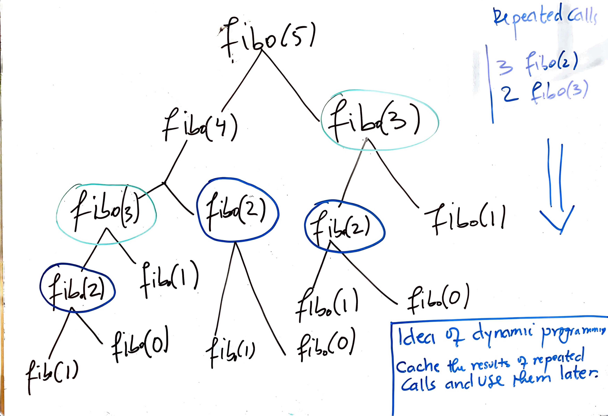

## Recursion

<a name='0'></a>
*******

**Content:**
* [Introduction](#1)
* [Example of Recursive Functions](#2)
* [The Downside of Recursion](#3)
* [References](#4)
*******

<a name='1'></a>
### 1. Introduction

* Recursion is a powerful technique that can be used to solve complex and long tail problems.

* Generally speaking, recursion is a process of defining and solving a problem in terms of simpler versions of itself(the problem).

* Algorithmic speaking, recursion is a technique used to design solutions to problems by using `divide-and-conquer` or `decrease-and-conquer` to reduce a given problem to simpler versions of the same problem. 

* Functional speaking, recursion is a programming technique in which a function calls itself repetitively.

* Mathematically speaking, a recursive function is a function which is defined in itself. Ex: `f1(n) = f1(n-1) + f1(n-2)`, `f2(n) = n * f(n-1)`.
  
* A good description for problems that can be solved with recursion are problems that can be divided into many similar subproblems.

* Recursion is essentially based on `divide and conquer` technique where we divide the problem into different subproblems, solve each subproblem recursively, and combine the results to form the final solution.

* While solving a problem recursively might make use of fewer codes, it time and space inefficient. The space of recursive problems is often O(n), where n is the depth or total number of recursive calls. Also equivalent to O(2<sup>k</sup>), where k is the number of the nodes that have children in a recursive tree. Plotting the tree is the best way to find the time complexity of the recursive function.
  
* Most recursive problems can be solved iteratively with `for` and `while` loops. While recursion might make use of few codes than iterative approach, the iterative approach might take less computation time and space. There a fair trade-off between recursion and iterative approach.
  
* A recursive function must have at least one `base case` that defines a solution to the special and simplest case of the problem. If there is no base case, the function can run infinitely and that's not good(computer's memory is a finite resource).

* In addition to the `base case`, a recursive function should have one or more `recursive (inductive) cases` that defines the solution of the problem on the other simpler versions of the problem.

<a name='2'></a>
### 2. Example of Recursive Functions

#### 2.1 Multiplication of two numbers

* Given two numbers, return their multiplication without using arthimetic operator of `*`. 
* Solution: Multiplying a and b is basically like adding a to itself b times. Ex: `5 * 4 = 5 + 5 + 5 + 5 = 5 + (4-1)`

* Using iterative approach:

```python
def multi_iter(a, b):

    ans = 0
    while b > 0:
        ans += a
        b -= 1
        
    return ans
```

* Using recursive approach:

```python
def multi(a, b):
    """
    Edge case: b = 1
    """
    
    if b == 1:
        return a
    else:
        return a  + multi(a, b - 1)
```

#### 2.2 Factorial

* Factorial is the hello world of recursion.
* The factorial of a number n is equal to `n! = n * (n - 1)!`, ex: `7! = 7 * (7-1)!`
* Iterative approach:

```python
def fact_iter(n):
    
    fact = 1
    
    while n > 0:
        fact *= n
        n -= 1
    return fact
```
* Recursive approach: Base case if for `1!` and `0!`.  Factorial of 1 and 0 are 1.

```python
def factorial(n):
    """
    Base case: 1! = 1, 0! = 1
    """
    if n == 1 or n == 0:
        return 1
    
    else:
        return n * factorial(n - 1)
```

#### 2.3 Fibonacci numbers

* The basecase for fibonnaci numbers are at 1 and 0: `fib(1) = 1`, `fib(0) = 0`.

* `fib(n) = fib(n - 1) + fib(n - 2)`
  
```python
def fibo(n):
    if n == 0 or n == 1:
        return n
    
    else:
        return fibo(n-1) + fibo(n - 2)   
```

#### 2.4 Palindrome Strings

* Recursion can also be applied on strings. 
* Example: Given a string, check whether the string is palindrome. Palindrome string can be read same way backward and forward. Ignore all punctuations and blank spaces.
  
* For a string to be palindrome, the first and the last characters must be similar. We can thus reduce the string each step removing the first and last characters, checking if first & last characters are equal until the string remains with one character which is the `base case`.

```python
def is_palindrome(stri):
    
    # Remove the spaces and blanks
    
    stri = stri.lower()
    chars = 'abcdefghijklmnopqrstuvwxyz'
    
    stri_cleaned = ''
    
    for c in stri:
        if c in chars:
            
            stri_cleaned += c
    
    if len(stri_cleaned) <= 1:
        return True
    else:
        return stri_cleaned[0] == stri_cleaned[-1] and is_palindrome(stri_cleaned[1:-1])
  
```

<a name='3'></a>
### 3. The Downside of Recursion

* As we saw in the beginning, recursion is a powerful technique but it takes lots of time and space. More precisely, recursive functions take O(2<sup>n</sup>) exponential time, where n is the number of nodes in a recursive tree and the total depth of the tree is 2<sup>n</sup>. The runtime of recursive function increases exponentially as n increases.

* Let's take an example for the recursive function of fibonacci numbers we did before:
  
```python
def fibo(n):
    if n == 0 or n == 1:
        return n
    
    else:
        return fibo(n-1) + fibo(n - 2)   
```

* The fibonnaci of small values of n is not so hard to compute but for large n, it's extremely time and space exhaustive. Take an example: fibo(120) is`8,670,007,398,507,948,658,051,921`. It can take `250,000 years` to compute that per time complexity analysis. Try running it!!

* For some problems, recursion might be all you need. But for other problems, we may need something much more. We need a more optimal way.

* Dynamic programming is an efficient technique used to solve problems that can be divided into similar subproblems. It's essentially taking the recursive algorithm and finding the overlapping subproblems(similar or repeated calls) and then caching the results of those repeated calls to be used later rather than recomputing them multiple times.

* Taking an example: the `fibo(5)` will have `3 fibo(2)` and 2 `fibo(3)` repeated calls. How can we cache the results of those repeated calls to use them later so as to save time and space?


***Image: The recursive tree of `fibo(5)`.  Image by author.***

* More about dynamic programming later!!

<a name='4'></a>
### 4. References

* Introduction to Computation and Programming Using Python, John V. Guttag
#### [BACK TO TOP](#0)