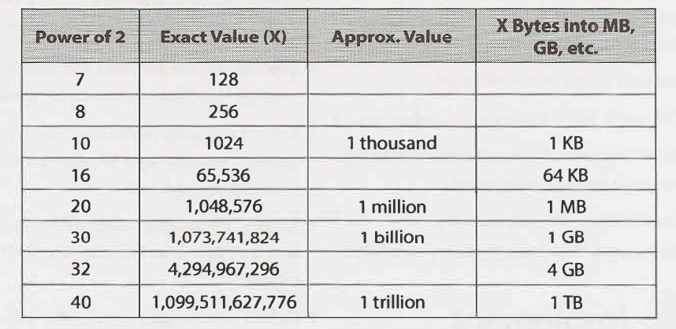

## Technical Questions

* Don't just read questions and solutions. Practice solving them, memorization won't help. 

### How to prepare:
* Try solving problem on your own. When solving a problem, think about time and space efficiency. 
* Write the code on paper.
* Test your code on paper: general cases, edge cases, corner cases, error cases. You will need to do this in interview anyways. 

*Need to know: The sorts of dat structure ad algorithms questions that many companies ask are not knowledge based, but assume a baseline of knowledge.*

### Must know: Core data structures, algorithms, and concepts. 

Data structures:
    - Linked lists
    - Trees, Tries, Graphs
    - Stacks & Queues
    - Heaps
    - Vectors/ArraysLists
    - Hash tables(very important!!!)

Algorithms:
    - Breadth-First-Search
    - Depth-First-Search
    - Binary Search
    - Merge Sort
    - Quick Sort

Concepts:
    - Bit manipulation
    - Memory(stack vs. Heap)
    - Recursion
    - Dynamic Programming
    - Big O Time & space

* It's rare that you will be asked to implement those things. But know their basics and try to implement them on your own. Also think about time and space complexity.
* Also know the power 2. Below is the table..It's useful for questions involving scalability or any sort of memory limitation.

### Walking through the code

* Listen: pay close attention to any info about the problem. 
* Get a brute force solution ASAP. but don't code it yet. 
* Optimize the brute force and get a better solution. Try to think about time vs space complexity. 
* Walk through the approach in the detail and make sure you understand it before coding. 
* Implement the code. The goal is to write beautiful code. 
* Test the code. Walkthrough the code like you would for a detailed code review. 
* Keep talking. Your interviewer want to know how you are interviewing. 

