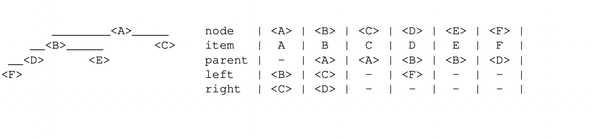
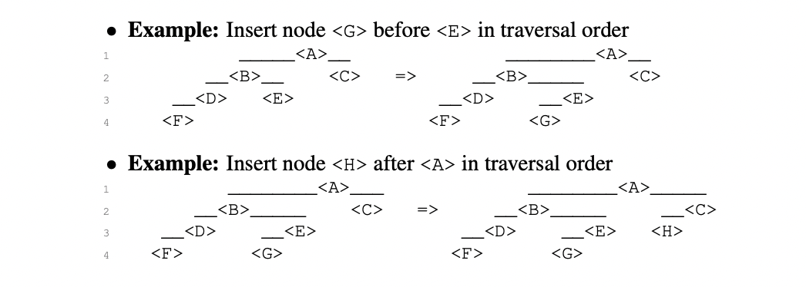
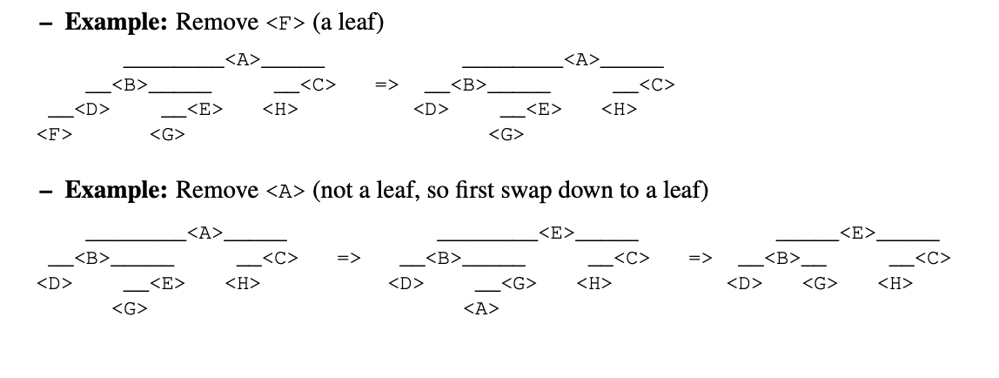

## Binary Search Trees

* A binary search tree is a tree (or connected graph with no cycles) of binary nodes.
* A binary tree is a pointer-based data structure with four pointers per node:
  * A pointer to an item stored at the node
  * A pointer to a parent node(possibly None)
  * A pointer to left child node(possibly None)
  * A pointer to the right child node(possible None)
* Put it simply, here is the node representation: `node.{item, parent, left, right}`.
* Why binary search tree anyways?
  * Some data structures allows resonable fast search or flexible update, but not so fast search and flexible updates.
  * Linked list supports insertion and deletion in constant time `O(1)` but searching nodes takes can take a worst case time `O(n)` since they may be far from the head.
  * Sorted array support binary search and logarithmic querry times, but at the cost of linear time update.
  * The single most advantage of binary search is that if we can keep the height `h` of the tree low, i.e `O(logn)`,and only perform operations on tree that run in time on the order of the height of the tree, then these operations will run in `O(h) = O(logn)` time which is closer to `O(1)` and much better than `O(n)`.
  * It's is possible to construct a binary tree on `n` nodes such that no node is more than `O(log n)` pointer hops away from the root as there exist binary trees with logarithmic height.
  * To sum up binary trees complexity, basic search tree operations take time proportional to the height of the tree. On average, for the a complete binary tree with nodes n, the basic dynamic set operations takes `O(logn)` time.
* Binary search trees support four main operations: `searching, traversal, insertion, and deletion`.
* Binary search trees also supports `minimum, maximum, predecessor, and successor`. 
* As binary search trees are pointer based data structure, they can be used as dictionaries.

### Some Binary Trees Terminologies

Example of tree:


* `The root` is the binary tree node that doesn't have a parent node (like `< A >`). A binary tree has only one root node.
* A `leaf` node has no children node. A leaf of tree are nodes that don't have children nodes such as `< F >, < E >, < C >`.
* The `depth` of a node < X > in the subtree rooted at root `< R >` is the length of the path from `< X >` back to `< R >`.
* The `height` of node < X > is the maximum depth of any node in the subtree rooted at < X >.

### Traversal Order

* All nodes in a binary search tree has a natural or inherent order based on the fact that we distinguish one child to be left and one child to be right.
* The traversing order follow these 2 rules:
  * Every node in the left subtree of node < X > comes **before** < X > in the traversal order.
  * Every node in the right subtree of node < X > comes **after** < X > in the traversal order.

* Given a binary node < A >, we can list the nodes in < A >'s subtree by recursively listing the nodes in < A >'s left subtree, listing < A > itself, and then recursively listing the nodes in < A > right subtree. Such algorithm runs in O(n) time because every node is recursed only once during constant time work:

```python
def subtree_iter(A):
    if A.left:
        yield from subtree_iter(A.left)

    yield A
    if A.right:
        yield from subtree_iter(A.right)
```
* The traversal order for the tree below is (< F >, < D >, < B >, < E >, < A >, < C >).


* The algorithm above doesn't consider the items stored in the node and the traversal order. If we consider the items or keys stored in the node, by definition(Skienna), all the keys smaller than the root key must lie in the left subtree of the root, and all keys bigger than the root must lie in the right subtree. To visit the nodes, we can recursively traverse the tree...

```python 
def traverse_tree(A):
    if root is None:
        traverse_tree(A.left)
        process_item(A.item) #Each item must be processed once during the tree traversal, resulting in O(n) time. Each node traversal is O(1).
        traverse_tree(A.right)
```

### Navigating the Tree

* Given a tree, it will be useful to traverse the nodes in their traversal order efficiently. 
* The most straight forward operation is to find the node in a given node's subtree that appears first or last in traversal order.
* To find the first node in subtree, simply walk left if a left child exists. Put it simply, to find the first node in traversal order:
  * If < X > has left child, recursively return the first node in the left subtree. If a node has left child, it's simply not the first node in traversal order.
  * Otherwise, < X > is the first node, so return it.
  * Running time is O(h) where h is the height of the tree.
  * Finding the last node in a subtree is symmetric.
  * Example: the first node in < A >'s subtree is < F >.

* Below is code for finding the first and last node in subtree:

```python
def subtree_first(A):
    if A.left:
        return subtree_first(A.left)
    else:
        return A
```
```python
def subtree_last(A):
    if A.right:
        return subtree_last(A.right)
    else:
        return A
```

* We can also find the successor(the next node in traversal order) and predecessor(the previous node in traversal order). 
  * If a node < A > has right child, then < A >'s successor will be the first node in the right child's subtree.
  * Otherwise, < A >'s successor can not exist in < A >'s subtree if it doesn't have right child. Return the lowest ancestor of < X > for which < X > is in the left subtree.
  * Running time is O(h) where h is the height of the tree.
  * Example: Successor of: `< B > is < E >, < E > is < A >, and < C > is None`. Recall that the traversal order is `< F >, < D >, < B >, < E >, < A >, < C >`.

### Minimum and Maximum

* We can always find the element in a binary tree whose key is a minimum by following left child pointers from the root until we encounter a NIL or None.

```python
def tree_min(A):
    while A.left is not None:
        A = A.left
    return A
```

* Finding the node with the maximum key:

```python
def tree_max(A):
    while A.right is not None:
        A = A.right
    return A
```

### Dynamic Operations on Trees

* To add or remove items in a binary tree, we must preserve the traversal order of the other items in the tree.
* To insert a node < B > before a given node < A > in the traversal order, either < A > has left child or not:
  * If < A > does not have left child, simply add < B > as left child of < A >.
  * Otherwise, if < A > has a left child, add < B > as the right child of the last node in < A >'s left subtree(which can not have a right child). Or in other words, make < B > the left child of < X >'s successor.
  * Running time is O(h), where h is the height of the tree.

* Below is example:

* *Example 1: Insert node < G > before < E > in traversal order : **E has no right left, so make G the left child of E.***

* *Example 2: Insert node < H > after < A > in traversal order : **< A > has right child, so make H the left child of < A > 's successor.***

* To delete the item contained in a given node from its binary tree, there are two cases based on whether the node storing the item is a leaf:
  * If the node is a leaf, simply clear the child pointer from the node's parent and return the node. A leaf node has no children.
  * Otherwise, < X > has a child(not a leaf):
    * If < X > has a left child, swap items with the predecessor of < X > and `recurse` until the node < X > is the `leaf`.
    * Otherwise, < X > has a right child, swap items with the successor of < X > and `recurse` until the node < X > is `leaf`.
  * The running time is O(h), h being the height of the tree.

* Below is example of deleting node in tree:


* *Example 1: Remove < F > (a leaf) : **F is a leaf or has no child, so simply remove it and you're safe.***

* *Example 2: Remove < A > (not a leaf, so first swap down to a leaf) : **A is not leaf, so swap down to a leaf...Recurse until it is the leaf node and remove it.***


### Balanced Binary Trees

* A binary tree that maintains `O(logn)` height under dynamic operations is called balanced tree.
* If a tree is balanced, all O(h) operations will take O(logn) time. 
* There are many balancing schemes such as Red-Black Trees, B-Trees, 2-3 Trees, Splay Trees, etc.
* The oldest (and perhaps simplest) balancing method is called an AVL Tree(Adelson-VelskyandLandis,1962).
* More about AVL in MIT Intro to Algorithms, [notes](https://ocw.mit.edu/courses/electrical-engineering-and-computer-science/6-006-introduction-to-algorithms-spring-2020/lecture-notes/MIT6_006S20_lec7.pdf)and [recitation 7](https://ocw.mit.edu/courses/electrical-engineering-and-computer-science/6-006-introduction-to-algorithms-spring-2020/lecture-notes/MIT6_006S20_r07.pdf).

* **LEARN MORE IN REFERENCES**

### References:

* MIT Introduction to Algorithms: 6.006
* Algorithms Design Manual by Steven Skienna
* MIT Introduction to Algorithms Book

