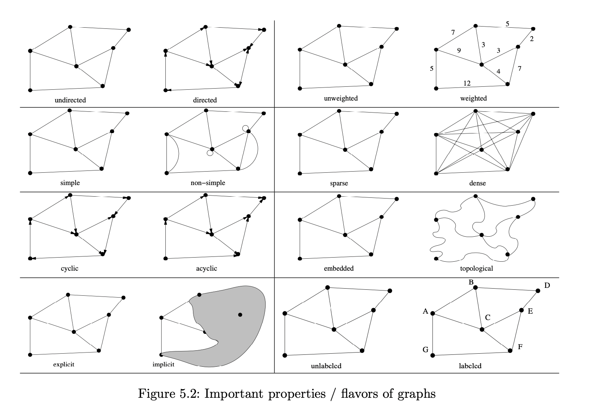
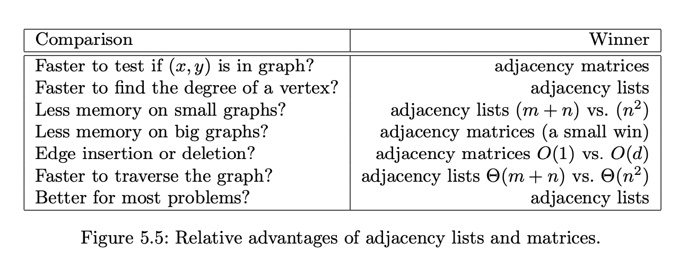

## Introduction to Graphs

* Graphs are one of the most important data structure in computer science. They are everywhere. 
* Graphs are abstract representation that describes the organisation of transportation systems, human interactions, social networks, electronic circuits, and computer networks....
* A graph `G=(V,E)` consists of vertics V(also called nodes or points) together with vertices pair or edges E(also called links or lines). The vertices pairs can be ordered or unordered. 
* Graphs are so powerful that they can be used to represent any kind of relationship. That is to say that most computational problems can be solved with graphs. Example: electronic circuits can be modelled as graphs, with junctions as vertices and components as edges. Also neural networks can be represented as graphs, where the neurons are edges and the layers(?) as vertices.
* If we analyze a computer program as graphs, the vertices can be lines of codes, with an edge connecting lines x and y if y is the next statement executed after x. 
* Also, a network of roads can be modelled as graphs, where cities are vertices and road between cities are edges. 
* Thus, most algorithmic problems can be solved as graphs. 
* It is extremely difficult to design novel algorithms. The secret sauce of designing new and efficient graphs algorithm is to understand the existing ones and learn from there. Being familiar with many different graph problems is very important than mastering one particular graph algorithm. 
  
* Let's see types of graphs.

#### Types of Graphs

* Undirected vs directed: A grapg G is undirected if edge E (x,y) implies that (y,x) is also in E. Otherwise, the graph is directed. 
* Weighted vs Unweighted: In Weighted graphs, edges or vertices have a value or weight associated to them. Unweighted graphs doesn't have such association. In unweighted graphs, the shortest path between two vertices must have fewest number of edges, and can be found using breadth-first search. Finding shortest path in weighted graphs is a complicated task. 
* Simple vs Non-simple: Simple graphs don't have self-loop(an edge (x,x) involving only one vertex) and multiedge(an edge (x,y) that occurs more than once in the graph). Non-simple graphs have self-loop and multiedges and they are difficult to deal with. 
* Sparse vs Dense: In sparse graphs, only small fraction of vertex pairs have edges between them. In dense graphs, a large portion of the vertex pairs defines the edges. Put it in other words, dense graphs typically have a quadratic number of edges while sparse graphs are linear in size. Example of sparse graph is a road network - because of the road junctions.
* Cyclic and acyclic graph: An acyclic graph does not have any cycles. Example of acyclic graph are Trees. In Direct Acyclic Graph(DAG), a directed edge(x,y) indicates that activity x must occur before y. 
* Embedding vs topological: In embedding graphs, vertices and edges are assigned geometric positions. 
* Labelled vs unlabelled: Each vertex is assigned an unique name or identifier in labelled graph to separate it with other vertices. Most graphs are naturally and meaningfully labelled (like city names in a transport network). 

Here is a picture that illustrate all types of graphs. 


Credit: Algorithms Design Manual, S.S. Skiena. The notes in this file also heavily relies on the book. 

In his Algorithms Design Manual book, Skiena uses a friendship graph to explain the above types of graphs. In friendship graph, vertices are people, and there is an edge between two people if they are friends. They are also called social networks. 

```
Takeaway: graphs can be used to model a wide variety of structures and relationships. Most computational problems can be represented in graphs.  
```
#### Graphical Data structures

* Selecting the right data structure for the graph is an important task that affect the performance. 
* Graphs data structures:
  * Adjacent matrix: We can represent G using an nxn matrix M where element M[i,j] = 1 if (i,j) is an edge of G, and 0 otherwise. It can make it faster to answer questions like `is (i,j) in G?` and quick updates for edge insertion or deletion. Adjacent matrix takes lots of space for graphs that have many vertices and relatively fewer edges. 
  * Adjacent lists: Adjacent lists are better for most problems. We can use them to efficiently represent sparse graphs by using linked lists to store the neighbors adjacent to each vertex. Adjacent lists are harder to verify if a given edge is in graph. 

Below is a comparison between adjacent lists and matrices. Image from the book credited book above



Credit: Algorithms Design Manual, S.S. Skiena.