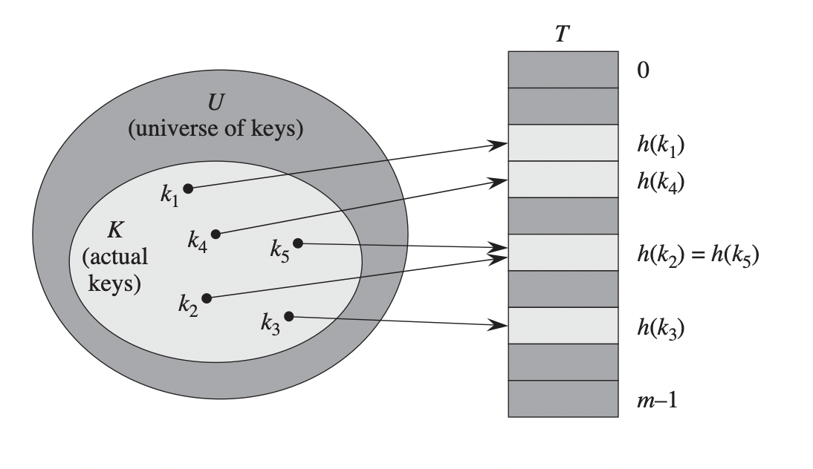

## Hash Tables

* Hash tables are effective and practical data structures for implementing dictionaries.
* A dictionary stores keys and their assocciated values in a pair. It's a key-value pair data structure.
* A dictionary supports only three operations: `insert`, `search`, and `delete`.
* Ordinary unsorted array takes a `O(n)` linear time to search element in array. In sorted array, it takes `O(logn)` time. Searching a value in a linkedlist takes `O(n)` time. Can we do faster at searching a value than `O(logn)` of sorted array? Yes, absolutely. By using hash tables.
* Hash tables are extremely fast for searching the value of an item given its key. A searching operations takes `O(1)` constant time.
* Hash tables generalizes the simpler notion of an ordinary array. Direct addressing into an array gives us the ability to search element at arbitraly position in a constant time.
* A hash table typically uses an array size proportional to the number of actual stored keys. Thus, hash table is an effective way to directly addressing an array.
* A hash function is a mathematical function that maps keys to integers.
* We previously saw that hash tables are a simpler notion of ordinary array and hash tables are simpler direct direct access arrays. Let's review direct access arrays.

### Direct Access Arrays

* Direct access array is an ordinary static array that associates a semantic meaning with each array index location - specifically that any item x with key k will be stored at array index k. Keys must be integers for that to be possible.
* The key idea of dynamic access array is to give item a `unique` integer `key` in ${0.....u-1}$ and store item in an array at index k. Put it simply, associate a meaning with each index of array.
* To find or search an item having integer key `i`, a searching algorithm can simply look in array slot `i` to respond to the search querry in **O(1) worst-case constant time**.
* So, it the keys fits in a machine word(w), $u <= 2^w$, searching array and other dynamic operations can take constant time.
* The downside of direct access array is that the order operations(`find_min(), find_max(), find_prev(), find_next()`) will be very slow. Since there is no guarrantee of where the first, last or next element is, it will take the `u` time to do those operations. Imagine if `u` is very large, that's would be a pretty bad runtime.
* Also, when u is very large compared to the number of items being stores, storing a direct access array can be wastefull, or even impossible on modern machines.
* Take an example: Say you want to support the set `find(k)` operation on 10 letter names using direct access array. The space of 10 letter names would be `u ~ = 26^10 ~= 9.5 x 10^13`. Storing a bit array would require 17.6 TB of storage space. That's too much use of space. We can use hashing to overcome that.

Below are pseudocode for searching, inserting and deleting element in direct access array. Remember that they take `O(1)` runtime if u is less than the machine word.

```python
def direct_access_search(T, k):
    return T[k]
```
```python
def direct_access_insert(T, x):
    T[x.key] = x #exactly like inserting a new element in a dictionary in Python, T[k] = x
```

```python
def direct_access_delete(T, x):
    del T[x]
```

* To overcome the space usage of direct access array on large keys, we can use hashing.

### Hashing

* The downside of direct address array is that if the universe u is large, storing a table of T of size u maybe impractical, or even impossible given the memory available on a typical computer.
* If `n <<< u`, it is possible to get the performance benefits of a direct access array which is a linear space of O(n) by storing items in a `smaller dynamic direct access array` with m key slots $m = O(n)$ instead of `u` slots.
* Also, searching an item in hash table takes average case time of O(1).
* Such smaller dynamic direct access array would grow and shrink like dynamic array depending on the number of items stored.
* A hash table is a smaller dynamic direct access array.
* A hash function or a hash map is a function that maps item keys to different slots of the direct access array, $h(k) : {0,....., u - 1}>>>{0, ...., m - 1}$.

**Below is a hashmap: using hash function h to map keys to hash tables lots:**


Credit: Introduction to Algorithms book, MIT

* If there are no two keys that map to the same direct access index, then we will be able to have a constant time search as the hash table simply acts as a direct access array over the smaller domain m.
* If the space of possible keys is larger than the number of array indices, i.e $m < u$, then any hash function mapping possible u keys to indices m must map multiple keys to the same array index (shown in pic above $f(2) = f(5)$) by the pigeonhole principle.
* If two items associted with keys k1 and k2 hash to the same index, i.e $h(k1) = h(k2)$, the hashes or mapping of `k1` and `k2` `collides`.
* The effective technique for storing the collided items is chaining. 
* Chaining is a collision resolution strategy where colliding keys are stored separately from the orginal hash table. Each hash table index holds a pointer to a chain, a separate data structure that supports the dynamic set interface.
* A chain can be commonly implemented with a linked list or dynamic array. For small chains, dynamic sets operations can take constant time. For large chains, it can take linear time. 
* A good hash function can try to minimize the frequency of such collisions in order to minimize the maximum size of any chain. More about good hash funcs in references.

Below are pseudocode for dictionary operation on hash table T when collisions are resolved by chaining:

```python
def chained_hash_table_insert(T, x):
    insert x at the head of list T[h(.key)]
```
```python
def chained_hash_search(T, k):
    search for an element with key in list T[h(k)]
```
```python
def chained_hash_delete(T, x):
    delete x from the list T[h(x.key)]
```

### References

* [MIT Introduction to Algorithms, Recitation 4](https://ocw.mit.edu/courses/electrical-engineering-and-computer-science/6-006-introduction-to-algorithms-spring-2020/lecture-notes/MIT6_006S20_r04.pdf)
* Introduction to Algorithms book MIT
* Algorithms Design Manual by Steven S.Skienna
