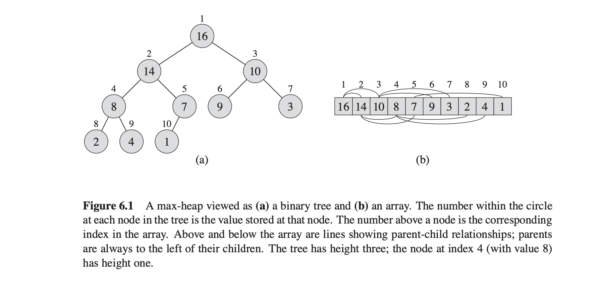

## Binary Heaps

* Heaps are simple and efficient data structures used for supporting the priority queue operations `insert` and `find-min`.
* Heaps are essentially a complete binary tree, where each node in the tree corresponds to the element of the array.

### Priority Queue

* Priority queues are data structures that provides flexibility in inserting new elements to a system in arbitraly order. 
  
* Priority queues has 3 main operations: 
  * `insert(Q, x)`: Given an element x with key k, insert it into the priority queue Q.
  * `extract_min(Q)` or `extract_max(Q)`: Return a pointer to the item whose key value is smaller or larger than any other key in the priority queue Q.
  * `delete_min(Q)` or `delete_max(Q)`: Remove the item from the priority queue Q whose key is maximum or minimum. 
  * Priority queue are usually optimized for either `max` or `min`, not both.
  
* The idea behind priority queue: keep track of many items, quickly access or remove the most important. Example: Router with limited bandwidth must prioritize certain kind of messages in an order of priority.
  
* Priority queues provide a general framework for 3 sorting algorithms: 
  * **Selection sort**: Built with *unordered* dynamic array data structure, O(1) insertion time, O(n) searching time, O(n^2) total sorting time.
  * **Insertion sort**: Built with *sorted* dynamic array, O(n) insertion time, O(1) searching time, and O(n^2) total sorting time.
  * **Heap sort:** Built with binary heap, O(logn) insertion time, O(logn) searching time, and O(nlogn) total sorting time.

### Binary Heaps Again

* Binary heaps can nearly be seen as a complete binary tree.
* In a tree, each node represents the element of the array. At above every node, there is a number that represents the index of the array value in a node. See below image.
  

Credit: Introduction to Algorithms Book

* The array A that represents heap has two attributes:
  * `A.length`: number of elements stored in array
  * `A.heap-size`: number of elements in the heap stored in array A. The valid elements of the heap are `A[1...A.heap-size]`
*  The root of the tree is A[1], and given the index i of a node, we can compute indices of its parent, left child, and right child as follows:

```python

def parent(i):
    return [i/2]
```
```python
def left(i):
    return 2 * i
```

```python
def right(i):
    return 2 * i + 1
```

* There are two types of binary heaps:
  
  * `max-heap` whose `heap property` is that for every node i other than the root node, `A[parent(i)] >= A[i]`. The value of a node is at most equal to its parent. Thus, the largest element in a max-heap is stored at the root and each node value is greater than the node subtree.
  * `min-heap` whose `heap property` is that for every node i other than the root node, `A[parent(i)] <= A[i]`. The value at the root node is the smallest element in min-heap.
  
* Max-heaps are used in heap sort algorithm. Min-heaps are used in priority queues.
* Since the heap can be seen as a tree, `height` of the node is number of edges on the longest simple downward path from the node to leaf(a node without children). The height of the heap is the height of the root node.
* Like binary search trees, the height of the heap is O(logn) and the basic heaps operations takes time proportional to the height which is `O(log n)`.
  
  * The `max-heapify` procedure maintains the `max-heap` property and it runs in O(log n).
  
  * The `build-max-heap` procedure produces a max heap from an unordered array and runs in O(n) linear time.
  
  *  The `heap sort` sorts an array in place and it runs in O(nlogn) time.
  *  The `max-heap-insert`, `heap-extract-max`, `heap-increase-key` and `heap-maximum` operations run in O(logn) time allowing the heap data structure to implement a priority queue.

### Maintaining the max heap property

* In order to maintain the heap property, we call the procedure max-heapify whose inputs are array A and index i.
* Max-heapify assumes that the binary trees rooted at left(i) and right(i) are max-heaps, but that A[i] might be smaller than its children thus violating the `max-heap` property.
* The max-heap property says that for every node i other than the root node, `A[parent(i)] >= A[i]`.

Below is pseudocode for max-heapify:

```python

def max_heapify(A, i):

    l = left(i)
    r = right(i)

    if l <= A.heap_size and A[l] > A[i]:
        largest = l
    else:
        largest = i
    if r <= A.heap_size and A[r] > A[largest]:
        largest = r
    
    if largest != i:
        exchange A[i]  and A[largest]
        max_heapify(A, largest)
```

### Building Max Heap

* We can use the procedure `max-heapify` in a bottom up manner to convert array `A[1..n]` where `n = A.length` into `max-heap`.
  

```python
def build_heap(A):
    A.heap_size = A.length
    for i = [A.length/2] downto 1:
        max_heapify(A,i)
```

### References

* MIT Introduction to Algorithms  6.006
* Algorithms Design Manual Skienna
* Introduction to Algorithms Book


For implementation of the binary heaps, check out MIT Introduction to Algorithms  6.006, [Recitation 8](https://ocw.mit.edu/courses/electrical-engineering-and-computer-science/6-006-introduction-to-algorithms-spring-2020/lecture-notes/MIT6_006S20_r08.pdf).