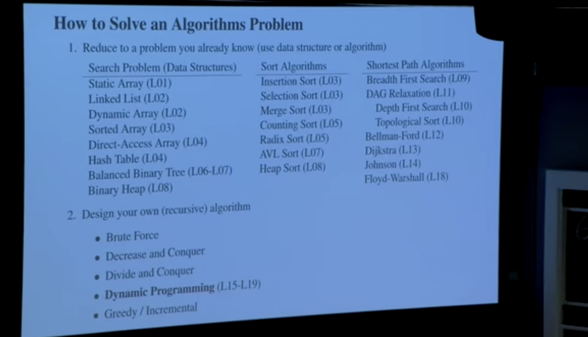

These are lecture notes of MIT Intro to Algorithms, Spring 2020.

Playlist: [Youtube](https://www.youtube.com/playlist?list=PLUl4u3cNGP63EdVPNLG3ToM6LaEUuStEY)

### Lecture 1: Algorithms and Computations

[Video](https://www.youtube.com/watch?v=ZA-tUyM_y7s&list=PLUl4u3cNGP63EdVPNLG3ToM6LaEUuStEY)

* The course is about teaching how to solve computational problems, communicating the solutions to others, prove corectness, and being aware that they way you are solving them is efficent.
* The goals in brief: solve computational problems, prove correctness, argue efficiency, and communicating ideas...and hence more writing than coding.
* A computational problem: Given the input and output having a certain kind of relation, can you check if the output is correct? 
* Example of a computational problem: Given an array of numbers, can you find the largest number in the array? Can you find the number at an index 5?
* The class is about general problems that have arbitarily size of inputs. 
* Algorithms: a function that takes input and maps it to output and that output better be correct. The real check of algorithm's correctness is to prove it's correctness by giving a true output. 
* Example of algorithms for birthday problem: 
    * Maintain record 
    * Interview students in same order
        * Check if birthday in record
            * If so, return a pair
        * Add new student to record
    * Return None if there is no output

* Algorithms are the core of computer science. They are the foundation of all the other fields(The whole sentence is suggested by GIthub Copilot and it seems right :)).
* Computer scientists write constant size piece of codes that can take any arbitarily sized input and loop(or recurse, or whatever) through the code in order to read the input and to produce output.
* Inductive hypothesis: If first k students contain a match, algorithm return a match before intervewing k+1 student.
* Meaning of efficiency: How fast does this algorithm run? And how fast does it compare to other possible ways of solving this problem?
* How to check efficiency? Time how long it takes to run the algorithm. Time also depends on size of data and the efficiency of the computer running the algorithm. So, that's not a correct meaning of efficiency.
* Checking efficency: Don't measure time, count operation instead! We expect the performance to depend on the size of the input n.
* A model of computation: 
    * WordRAM: Random access memory...Can randomly access different places in memory in constant time. A memory is a bunch of 1's and 0's.
    * CPU: Central processing unit, can hold and process instructions. 

* A byte: unit of modern computer memory. It's a collection of 8 bits.
* A number of addresses in 32-bit computer = 2 power 32 = 4GB which means in order to read something of 32bit in memory, you need to have a hard disk of at least 4GB.
* It takes a constant amount of time to operate on a constant amount of memory.
* Next lecture: Data structures

 

### Lecture 2: Data Structure and Dynamic Arrays

[Video](https://www.youtube.com/watch?v=CHhwJjR0mZA&list=PLUl4u3cNGP63EdVPNLG3ToM6LaEUuStEY&index=2)